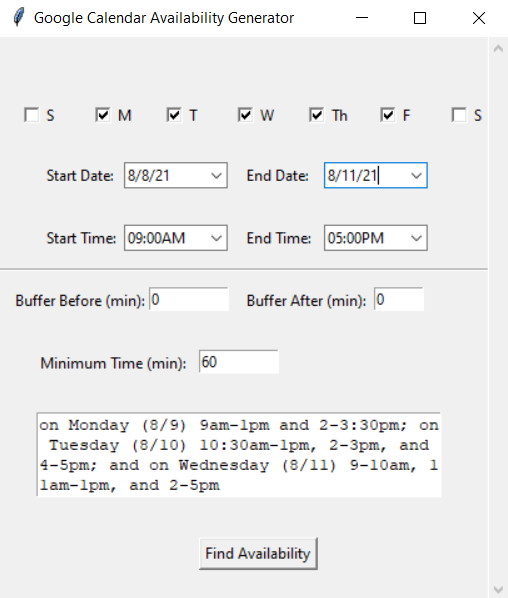

# Google Calendar Availability Formatter

This tool is designed to be a helpful tool for formatting your calendar availability for easy pasting into emails.
Now, whenever someone asks you "when are you free next week?", you can easily load up this tool and copy the
formatted availability into your email without worrying that you missed an appointment.

## Installation Requirements
This tool requires Python 2.6+, with the following dependencies:
```pip install pyperclip tkcalendar```

To interface with Google Calendar's API, you'll also need to follow the Prerequisite steps and Step 1 in the
[Google Calendar Python Quickstart Guide](https://developers.google.com/calendar/api/quickstart/python). 
Rename the "client-secret-***.json" file you receive as "credentials.json" and place it in this folder.

On line 19 of ```main.py```, you should also replace the calendar ID with your own Google Calendar's
calendar ID. You can find where the calendar ID is located 
[via this tutorial](https://docs.simplecalendar.io/find-google-calendar-id/).

Finally, you'll want to move the executable file ```gcal_availability_formatter.exe``` to somewhere
indexed by your operating system (e.g. the Downloads folder) so you can call your code via the search
bar (tested on Windows). The current executable file is customized for my system, however. To set up your
own similar file, follow the below steps on a Windows system:
1) Create a shortcut to ```cmd.exe``` (usually located in ```C:\Windows\System32```). Move the shortcut to 
   somewhere indexed by your operating system (e.g. the Downloads folder).
2) Right click the shortcut > Properties
   1) Target: ```%windir%\System32\cmd.exe "/K" C:\Users\ahadrauf\anaconda3\Scripts\activate.bat C:\Users\ahadrauf\anaconda3\envs\python37 & python main.py & exit```
      1) As you can see from this line, the shortcut will (1) Open a Command terminal, (2) Activate an Anaconda environment 
      called python37, (3) Run ```main.py``` within this Anaconda environment, and (4) exit the terminal once
         you exit out of the GUI. You can replace the Anaconda-specific lines with your configuration.
   2) Location: the location of this folder
   
This separation of the shortcut and the code is for simplicity's sake, since Windows doesn't index files in
all locations - this allows you to have the code in a separate location, while just keeping the shortcut in an
indexed file location.

## Interface


1) The top row allows you to select which days of the week you want to include in your availability listing. By
default, a Monday-Friday weekday is selected, although you can change this on lines 203-204 in the code.
   
2) The second row allows you to select the start date and end date of your availability listing.

3) The third row allows you to select your workday's start and end times.

4) The fourth row (below the horizontal line) allows you to select how many minutes of buffer you want
before and after meetings, e.g. for walking in between locations.
   
5) The fifth row allows you to select the minimum time interval posted on your availability listing. For 
example, the default 60 minutes ensures that no time slots under an hour are listed. This is for brevity 
   and clarity, since otherwise you could have lots of 15 or 30 minutes time intervals between meetings 
   that clutter up your availability posting.
   
6) The sixth row is the output box, which allows you to copy the resultant availability or inspect it
for errors. The availability will be copied to your clipboard automatically for convenience, however.
   
7) Finally, click the button at the bottom to begin the process!

## Caveats
1)  The code currently can't handle more than one Google Calendar input (e.g. if you have a work and home calendar)

2) The code currently can't handle all-day events (it just skips over any of these)
